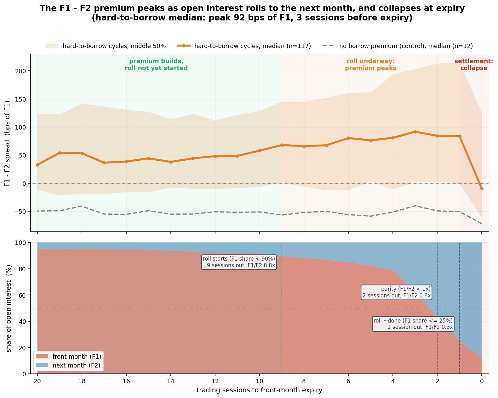
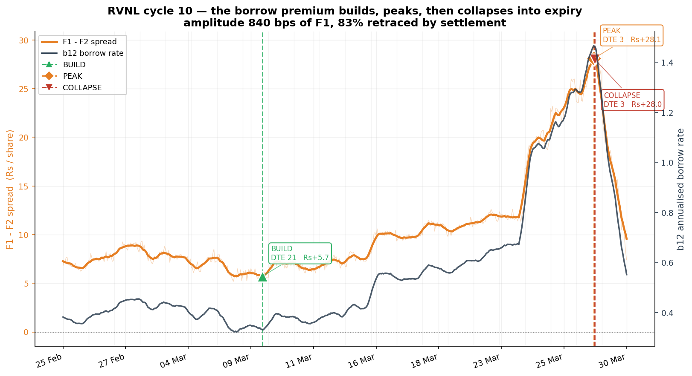
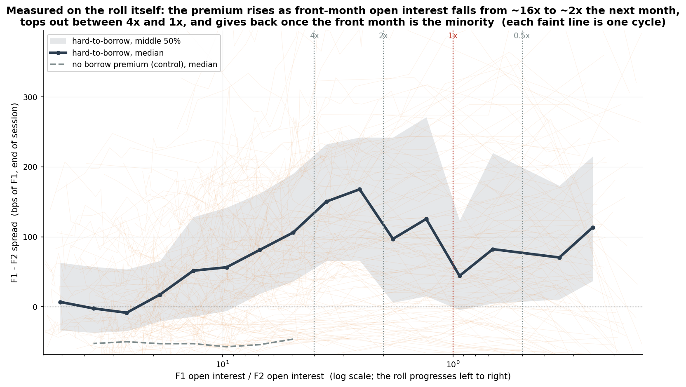
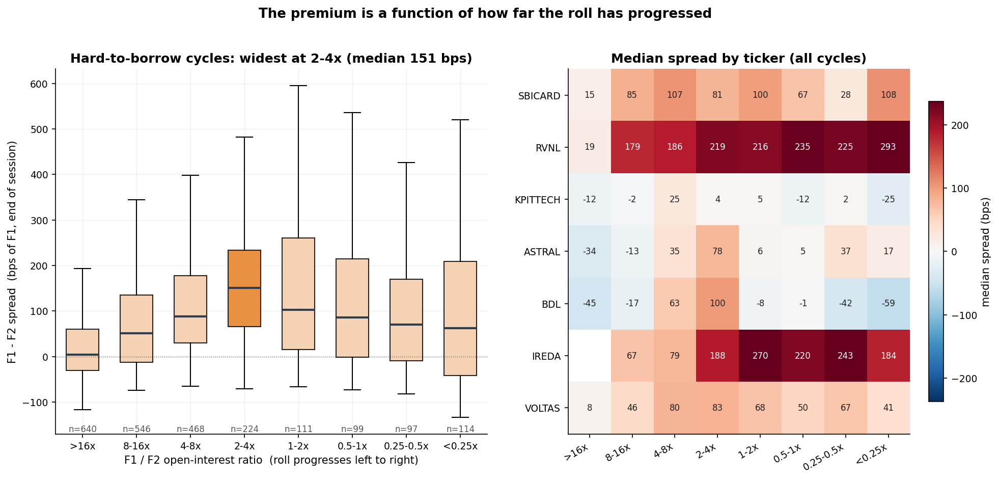
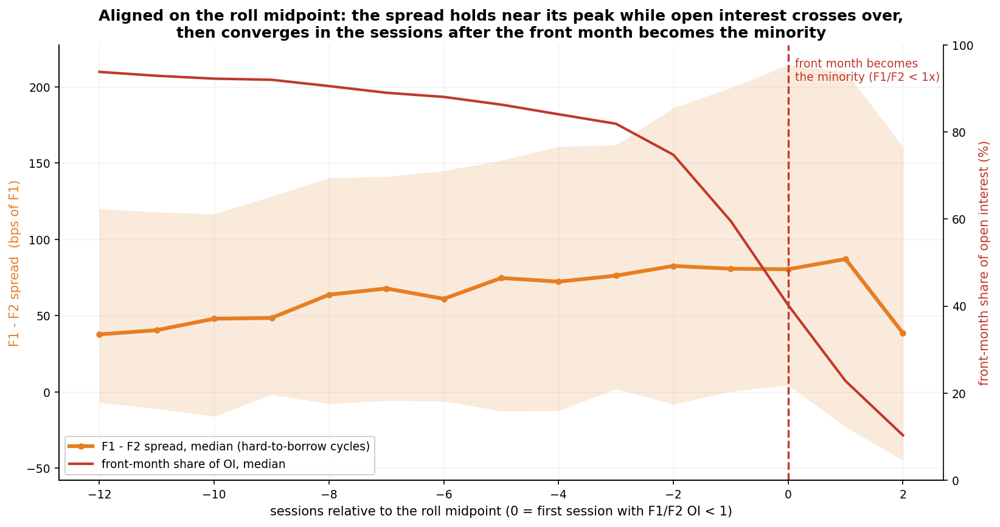
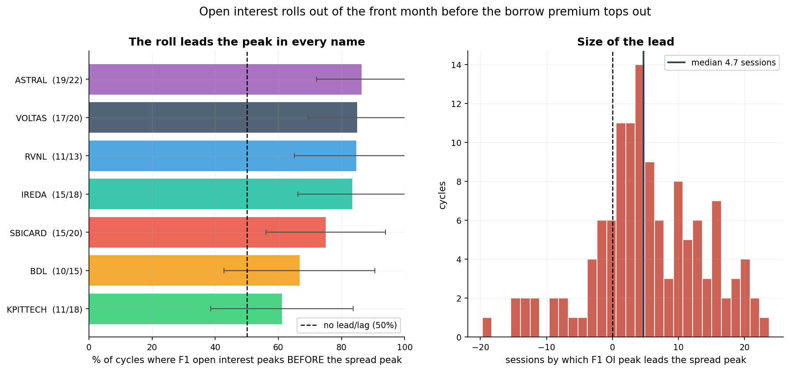
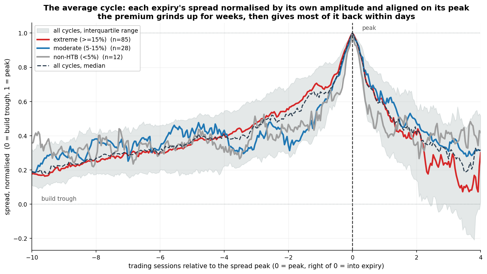
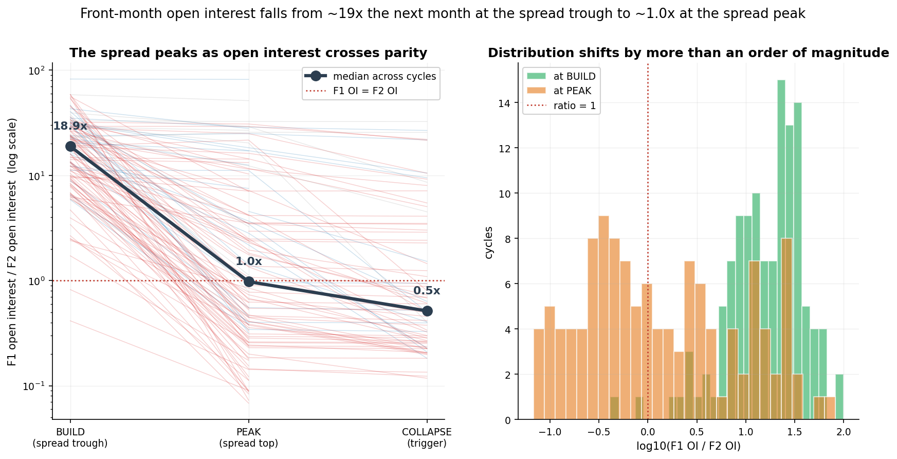
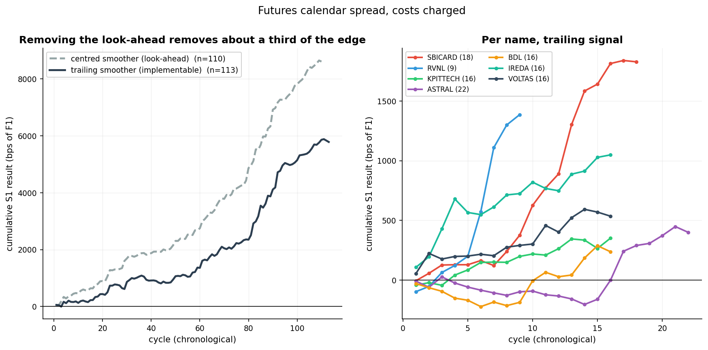

# The Borrow-Rate Cycle

**How the hard-to-borrow premium in NSE single-stock futures builds, peaks and
collapses with the monthly roll of open interest.**

When a stock is hard to borrow, short sellers short the front-month future instead,
which makes it rich against the next month. That premium is not random: it follows
the roll. It builds while short holders still sit in the front month, peaks while
their open interest moves to the next month, and collapses at settlement once the roll
is done. This repository measures that across **135 expiry cycles in 7 NSE names,
July 2024 – October 2026, on 72,203 fifteen-minute bars**, and tests whether it can be
traded.



**What the data says** (hard-to-borrow cycles; spread = F1 − F2 in bps of F1):

- **The premium builds before the roll starts and accelerates as it begins.** With 15
  sessions to go, 95% of open interest is still in the front month and the median
  spread is 44 bps. It climbs as holders start rolling, reaching a median **92 bps 3
  sessions before expiry**, when the front month still holds 63% of open interest
  (F1/F2 ≈ 1.7×).
- **It peaks while open interest crosses over.** Cycle by cycle, the spread tops out at
  a median F1/F2 open-interest ratio of **0.81×**, i.e. right as the front month stops
  being the majority, **2 sessions before expiry**. Measured on the ratio itself, the
  spread is widest at **2–4×** (median 151 bps). It is near zero while the ratio is
  above 16×.
- **It collapses once the roll is done.** One session out, with only 25% of open
  interest left in the front month, the spread is still 84 bps. By the expiry close
  it has converged to −9 bps.
- **The control behaves as the mechanism predicts.** Cycles with no borrow premium sit
  flat at about −50 bps (normal carry) through the whole roll, with no build, peak or
  collapse.
- **Tradeable, modestly.** With a trailing (no look-ahead) signal, a short-F1 /
  long-F2 calendar returns **+51 bps per cycle** over 113 cycles (64.6% win, per-cycle
  Sharpe 0.50). The win rate rises with the borrow premium: **0% → 61% → 78%** across
  the three tiers.

**Explore every cycle:** [`docs/explorer/index.html`](docs/explorer/index.html), an
interactive page where you pick a ticker and expiry and compare it with the population
(serve `docs/` with GitHub Pages, or `python -m http.server` locally).

**What was wrong with the original research, and is corrected here:** a look-ahead
smoother, a sample-selection gate, an inverted slippage sign, and a published
explanation of a failure that the data does not support. Together they had produced
*"100% win rate over 22 cycles, Sharpe 1.83"*. The corrected result above is weaker
and considerably more believable. See [docs/05_limitations.md](docs/05_limitations.md).

---

## 1. The mechanism

A stock becomes **hard to borrow** when short interest is high relative to lendable
inventory. Borrowing it in the Securities Lending & Borrowing (SLB) market gets
expensive, so short sellers use **single-stock futures** instead: no borrow is
needed, and the exposure is identical.

That demand sits in the **front month (F1)**, where the liquidity is, so F1 trades
rich against the **next month (F2)**. Shorts have to roll before F1 expires. As they
do, their open interest moves to F2, and at expiry F1 converges to spot by
definition. The premium has to go: not because anyone changes their mind about the
stock, but because the contract stops existing. **The collapse is mechanical, which is
why it does not depend on which way the stock moves.**

The borrow rate implied between the two futures is

```
b12 = r − ln(F2 / F1) / (τ2 − τ1)        r = 6.25%,  τ = fractional trading-time DTE / 365
```

> `b12` is used only to *classify* cycles (tiers: < 5%, 5–15%, ≥ 15% at the cycle's
> peak), never to time them. It depends on both legs' time to expiry, while the
> traded quantity is the raw spread, so all timing uses the **F1 − F2 spread in bps
> of F1**. Note also that whenever F1 ≥ F2 the log term is ≤ 0, so b12 ≥ r = 6.25%.
> The conventional 5% threshold is therefore close to non-binding here: 90% of cycles
> clear it. See [docs/01_mechanism.md](docs/01_mechanism.md).



## 2. The premium is a function of the roll

Plot the spread against the F1/F2 open-interest ratio and the roll becomes the clock.
The premium rises as front-month open interest falls from about 16× to 2× the next
month, tops out between 4× and 1×, and gives back once the front month is the
minority:



| F1/F2 OI ratio | >16× | 8–16× | 4–8× | **2–4×** | 1–2× | 0.5–1× | 0.25–0.5× | <0.25× |
|---|---|---|---|---|---|---|---|---|
| Median spread, hard-to-borrow (bps) | 4 | 52 | 88 | **151** | 103 | 86 | 70 | 63 |

The same pattern by name, and the binned distributions:



It is strongest where borrow is tight (IREDA, SBICARD, RVNL). In KPITTECH, ASTRAL,
BDL and VOLTAS the spread builds little and mostly just converges at expiry
([figure 17](figures/17_roll_profile_by_ticker.png)).

Aligning every cycle on the session when the front month becomes the minority shows
the spread holding near its peak through the crossover and converging after it:



Full method and thresholds: [docs/08_roll_mechanics.md](docs/08_roll_mechanics.md).

## 3. Does the roll lead the peak?

If shorts rolling out of the front month drive the collapse, their open interest
should turn down *before* the spread tops out. It does in **106 of 135 cycles (79%,**
binomial p = 2×10⁻¹¹), with a median lead of 4.7 sessions. At the spread peak,
front-month open interest has already fallen to a median **56% of its own maximum**.



## 4. The shape of the cycle

Each cycle's spread is normalised by its own amplitude and aligned on its peak, so
cycles of different size are comparable. The asymmetry is the finding: a slow grind up
over weeks, then a sharp give-back over days.



| | p25 | median | p75 |
|---|---|---|---|
| Days to expiry at build start | 20 | **26** | 27 |
| Days to expiry at peak | 1 | **4** | 14 |
| Amplitude, trough to peak (bps of F1) | 63 | **121** | 222 |
| Retracement (given back ÷ built) | 0.38 | **0.83** | 1.24 |

The *shape* is common to all three borrow tiers, but the *size* is not: median
amplitude is 38 bps in non-hard-to-borrow cycles against 168 bps in the extreme tier.
This is not generic mean reversion either. Anchoring the same measurement on
arbitrary mid-cycle spread peaks gives a median retracement of **0.35**, against
**0.83** into expiry (p = 3×10⁻⁸). Qualifications: the peak falls inside the final
expiry week in 68% of cycles, 13% have a build trough at the cycle boundary, and
`build < peak` is true by construction. That is why the placebo, not the ordering,
carries the claim. Details: [docs/02_cycle_anatomy.md](docs/02_cycle_anatomy.md).



## 5. Trading it

**Entry:** the first bar after the smoothed spread peaks where slope and
acceleration are both negative. **Exit:** the last bar at or before 12:00 on expiry
day. **Costs:** 0.1% slippage per futures leg, charged on entry and exit. Three
constructions: **S1** short F1 / long F2 (futures only), **S2** the same through
options, **S3** long call on F2 + short put on F1.

| Scope | n | Win | Mean | Sharpe |
|---|---|---|---|---|
| As originally published *(2 names, options-gated, look-ahead, costs credited)* | 22 | 100% | ₹+13,429/lot | +1.83 |
| Costs charged correctly | 22 | 86% | ₹+8,674/lot | — |
| All names, no gate, look-ahead signal | 110 | 76.4% | +78.3 bps | +0.77 |
| **All names, no gate, trailing signal** | **113** | **64.6%** | **+51.2 bps** | **+0.50** |

The last row is the honest one. The edge concentrates where the mechanism says it
should:

| Borrow premium at peak | n | Win rate | Mean bps |
|---|---|---|---|
| Non-HTB (<5%) | 13 | 0% | −37.8 |
| Moderate (5–15%) | 28 | 61% | +10.3 |
| **Extreme (≥15%)** | **72** | **78%** | **+83.2** |



The result is the spread collapse and nothing else. S1's per-cycle P&L correlates
**+0.95** with how far the spread converged, and it is profitable whether the
underlying rose (+₹11,164) or fell (+₹13,418).

## 6. What doesn't work

- **S3 loses money, and not for the published reason.** The original attributed it to
  vega, but next-month implied vol *rose* in 71% of these trades. A long call plus a
  short put is a **synthetic long**: S3 correlates **+0.93** with the underlying and
  **−0.07** with the spread. It was never trading the spread.
- **The borrow signal is barely visible in the options surface.** Front-month implied
  vol is, if anything, higher in non-hard-to-borrow cycles, and the difference is
  inconclusive (p = 0.063, 72 vs 11 cycles). Put skew does not track the borrow
  premium (ρ = +0.09, p = 0.42). Meanwhile the futures spread tracks it at ρ = **+0.77**
  (p = 8×10⁻²⁸).
- **The strategy loses where the mechanism is absent**, which is the correct behaviour
  for a mechanism-specific trade.

[docs/04_negative_results.md](docs/04_negative_results.md)

## 7. Limitations

The four corrected defects, plus:
- the parameters were chosen in-sample;
- 113 cycles across 7 correlated names is a smaller effective sample than it looks;
- the names were picked as known hard-to-borrow candidates rather than screened from a
  universe;
- the roll and the premium both follow the expiry calendar, so their alignment is
  consistent with the roll driving the premium but not proof of it;
- costs cover slippage only, with no fees, taxes, margin financing or market impact;
- the Sharpe is a per-cycle P&L ratio, **not annualised and not capital-adjusted**.

Read [docs/05_limitations.md](docs/05_limitations.md) before using any number here.

## 8. Reproducing this

All data lives in one place: the backtesting engine's **ArcticDB** store. The pipeline
in [`pipeline/`](pipeline/) builds it from the broker APIs, and the analysis reads it
directly; nothing is copied into this repository.

```bash
pip install -e .
# 1. data (skips everything already stored; tokens only needed for missing data)
python pipeline/fetch_ticker/fetch_ticker.py SBICARD RVNL KPITTECH ASTRAL BDL IREDA VOLTAS
python pipeline/build_borrow_rates/build_borrow_rates.py
python pipeline/build_features/build_features.py
# 2. analysis, figures and the explorer
make all          # or run scripts/01…08 in order
make test
```

Set `BORROWCYCLE_ENGINE_ROOT` if the engine isn't at its default path. Each script
folder has a README describing its inputs, outputs and method.

## 9. Repository map

| Path | What it holds |
|---|---|
| `pipeline/` | Data steps: `fetch_ticker` (futures, missing spot), `build_borrow_rates`, `build_features` |
| `borrowcycle/pipeline/` | Their library: ArcticDB access in the slim layout, Upstox/Kite clients, panel, borrow, features |
| `borrowcycle/` | Analysis library: data access, cycle detection, roll mechanics, backtest, statistics, plotting |
| `scripts/01…08` | Numbered, runnable analysis steps, one folder each |
| `tests/` | Tests on throwaway stores and synthetic cycles (never the engine store) |
| `results/` | Every number quoted above, as CSV or Markdown |
| `figures/` | The figures in this write-up (00–17); `appendix/` holds 125 exploratory charts |
| `docs/` | Mechanism, anatomy, results, negative results, limitations, data dictionary, provenance, roll mechanics; `explorer/` |

---

*Data: NSE single-stock futures (Upstox) and spot (Zerodha Kite), 15-minute bars. This
is research, not investment advice.*
