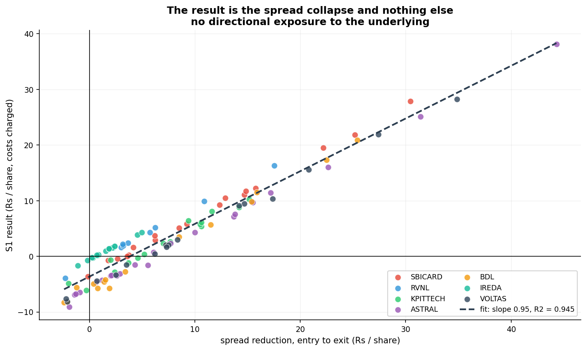

# Strategy and results

Generated tables: [`results/summary_stats.md`](../results/summary_stats.md).
Per-cycle data: [`results/pnl_per_cycle.csv`](../results/pnl_per_cycle.csv)
(wide scope, both smoother variants) and
[`results/pnl_headline_22.csv`](../results/pnl_headline_22.csv) (the original
sample, reproduced).

---

## 1. The trade

**Entry.** The first bar at or after the smoothed F1 − F2 spread peak where
slope < 0 and acceleration < 0 — the premium has topped and is decelerating.

**Exit.** The last 15-minute bar at or before 12:00 on front-month expiry day.
By then convergence is essentially complete, and the last half-session of a
settling contract is not somewhere to be carrying size.

**Costs.** 0.1% slippage per futures leg and 0.5% per options leg, charged on
entry and exit. Nothing else — see [05_limitations.md](05_limitations.md),
item 9.

**Constructions.**

| | Build | Exposure |
|---|---|---|
| **S1** Futures calendar | SHORT F1 + LONG F2 | The spread, and nothing else |
| **S2** Synthetic calendar | Synthetic short F1 + synthetic long F2, via options | The spread, with option-pricing noise |
| **S3** Asymmetric | BUY call on F2 + SELL put on F1 | **The underlying** — see below |

## 2. Reproducing the original, then correcting it

The published result reproduces exactly under `legacy_slip=True` and the
original options gate: **22 cycles, 100% win rate, ₹+13,429 per lot, per-cycle
Sharpe +1.83, ₹+295,447 cumulative.**

Three corrections then apply, each measured separately so the contribution of
each is visible:

| Step | n | Win | Mean | Sharpe |
|---|---|---|---|---|
| As published | 22 | 100% | ₹+13,429/lot | +1.83 |
| ① Charge slippage instead of crediting it | 22 | 86% | ₹+8,674/lot | — |
| ② Remove the options gate, add all 7 names | 110 | 76.4% | +78.3 bps | +0.77 |
| ③ Replace the centred smoother with a trailing one | 113 | 64.6% | +51.2 bps | +0.50 |

Each correction is documented in [05_limitations.md](05_limitations.md),
items 1–3. Step ③ is the number to use.

Units change at step ②: lot sizes are known only for SBICARD and RVNL, so
wide-scope results are reported in basis points of the front-month price rather
than rupees per lot. Basis points are also the more comparable unit across
names.

## 3. The result by borrow premium

This is the table that decides whether the mechanism is real. If the premium
is what generates the edge, the edge should scale with the premium — and it
should vanish where there is no premium.

**Trailing signal, costs charged, 113 cycles:**

| Tier | n | Win rate | Mean bps | Median bps | Sharpe |
|---|---|---|---|---|---|
| Non-HTB (<5%) | 13 | 0% | −37.8 | −34.1 | −2.30 |
| Moderate (5–15%) | 28 | 61% | +10.3 | +4.7 | +0.22 |
| **Extreme (≥15%)** | **72** | **78%** | **+83.2** | **+70.3** | **+0.75** |

The ordering is monotone in win rate, mean and median, and it survives the
removal of the look-ahead. The non-HTB tier — where the mechanism predicts
nothing to harvest — loses money, which is the correct outcome for a
mechanism-specific trade rather than an embarrassment.

With n = 13 the control group is a consistency check, not a statistical test.

## 4. It is the spread, not the stock

S1's per-cycle result correlates **+0.95** with how far the spread converged
between entry and exit, and the relationship is close to linear with the slope
the construction implies.

Direction-neutrality, on the original 22-cycle sample where lot-denominated
figures exist:

| Underlying over the trade | mean S1 |
|---|---|
| Rose | ₹+11,164 |
| Fell | ₹+13,418 |

A convergence forced by expiry should pay either way, and it does.

## 5. Cycles that were not traded

Published rather than dropped, in the `skip_reason` column of
`pnl_per_cycle.csv`. The reasons are: no post-peak inflection within the cycle,
an exit timestamp at or before the entry (peaks that occur after the expiry-day
cutoff), and — in the reproduction scope only — the original options gate.

Publishing these is the point. A backtest that silently discards its awkward
cases is reporting a filtered sample, which is exactly how the original 22-cycle
result came to show a 100% win rate.

## 6. S2 and the reproduction gap

S2 reproduces to 9 cycles and ₹+9,615 mean against the original's ₹+9,765; S3
reproduces to 10 cycles against 13. The difference comes from the option data:
the analysis reads an ATM ±3-strike slice of the stored chains rather than the
full chains, so a small number of fallback repricings differ.

S1 — the headline, and the only construction with a clean result — reproduces
to the rupee, because it uses no option data at all.
